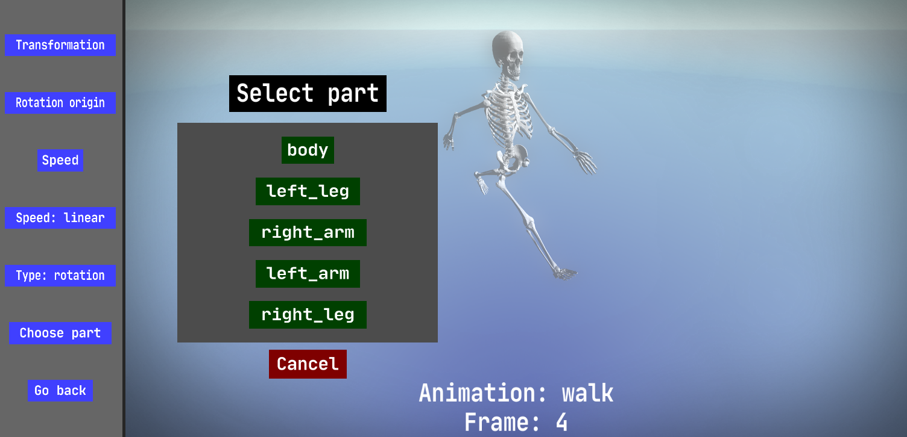

# Animation Editor

### General
- All animations will be saved in `projects\<your_project>\data\animation.fe3d`.
- You can **create/edit/delete** animations for **models**.
- Every created animation can be applied to models through **scripting**.
- You can select a **preview model** for the animation playback.
- An animation consists of 1 or more **keyframes**.
- You can **create/edit/delete** keyframes to make a full animation.
- You can toggle **debug rendering** with the `H` key.
- You can toggle **wireframe rendering** with the `F` key.
- You can **zoom the camera** with the mouse scroll wheel.
- Hold the `MMB` button to **move the camera** with your mouse.
- Use the `SPACE` key to move the camera **up** and use the `LSHIFT` key to move the camera **down**.
- Use the `UP` and `DOWN` keys to change the camera **zooming speed**.
### Keyframes
- The first keyframe is always the default model transformation.
- Every keyframe has a different **target** transformation.
- Every keyframe has a different animation **speed**, with 2 types to choose from: **linear & exponential**.
- Rotational transformations can each have a different **rotation origin**.
- If the model has **multiple parts**, each part has its own transformation every keyframe.
- The **last** animation keyframe should be the same as the **initial** frame, for a full animation.
### Properties
- **Transformation**: the speed of the transformation change. **Range**: -inf to inf.
- **Rotation origin**: the origin point which is rotated around. **Range**: -inf to inf.
- **Speed**: the speed of the transformation change. **Range**: -inf to inf.
